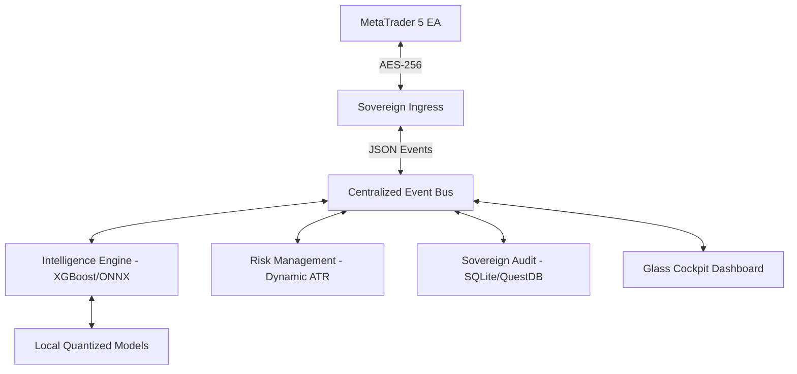

# 🔥 Project Phoenix - AAT V6.0
## *The Sovereign Evolution of Institutional Trading*

---

## 👁️ 1. Vision & Mission

**Vision:** To democratize institutional-grade algorithmic trading by providing a sovereign, transparent, and high-performance microkernel that rivals proprietary black-box systems.

**Mission:** To evolve the Autonomous AutoTrader (AAT) from a retail-hybrid system into a fully autonomous institutional execution engine, leveraging distributed intelligence, advanced SMC (Smart Money Concepts), and hardened security.

---

## 💎 2. Core Values

- **Sovereignty:** 100% FOSS. Your data, your keys, your execution.
- **Transparency:** No black boxes. Every decision is logged, audited, and verifiable.
- **Performance:** Sub-millisecond internal event latency, optimized for consumer-to-pro hardware.
- **Resilience:** Defensive architecture designed to survive market volatility and network instability.

---

## 🏗️ 3. Architecture (V6.0 Phoenix Microkernel)

Project Phoenix introduces a refined **Event-Driven Asynchronous Microkernel** that eliminates the circular dependencies of V5.0.

### 🧩 System Overview (Mermaid)

### 🛠️ Technical Specifications
- **Core Engine:** Python 3.11+ FastAPI Orchestrator.
- **Communication:** Centralized `src/shared/utils/bus.py` (Zero-coupling).
- **Security:** AES-256-CBC Encryption for all MQL5-Python traffic + JWT RBAC.
- **Database:** SQLite (Audit) + QuestDB (High-frequency telemetry).
- **Inference:** ONNX Runtime for INT8 quantized XGBoost and Transformer models.

---

## 🧠 4. Intelligence & Trading Strategy

### 📈 Institutional SMC (Smart Money Concepts)
- **Order Block (OB) Detection:** Automated identification of institutional accumulation/distribution zones.
- **Liquidity Grabs:** Real-time detection of stop hunts and "Engineered Liquidity."
- **Fair Value Gaps (FVG):** Detection of market inefficiencies for entry/target refinement.

### 🤖 V6.0 AI Model Stack
- **XGBoost Ensemble:** Ported to ONNX for 0.1ms inference.
- **Sentiment Transformer:** Local quantized FinBERT for real-time news impact analysis.
- **Wyckoff Phase Classifier:** LSTM-based detection of market cycles (Accumulation, Markup, Distribution, Markdown).

---

## 🛡️ 5. Hardened Execution & Risk

- **Real-time Equity Protection:** Dynamic lot sizing based on real-time MT5 balance fetching (no more hardcoded equity).
- **ATR-Derived Volatility Scaling:** Stop Losses and Take Profits that breathe with the market.
- **Watchdog Protocol:** Automatic circuit breakers if latency exceeds thresholds or heartbeat fails.

---

## 🗺️ 6. Roadmap: The Phoenix Ascent

### 📍 Phase 1: Foundation Overhaul (Current)
- [ ] Resolve EventBus circular dependencies.
- [ ] Implement secure bidirectional AES response handling.
- [ ] Standardize local model quantization (ONNX).

### 🚀 Phase 2: Advanced Intelligence
- [ ] Integrate Wyckoff Phase detection logic.
- [ ] Deploy multi-broker Hub synchronization.
- [ ] Launch Sentiment Analysis integration for High-Impact news.

### 🌐 Phase 3: Distributed Citadel
- [ ] Full React/Next.js "Glass Cockpit" Portal.
- [ ] Multi-node monitoring and cloud-sync capability.

---

## 👥 7. Team & Roles

- **Architect:** Lead Designer of the Microkernel and Event-Driven logic.
- **Quant Engineer:** Developer of SMC logic and AI model training/quantization.
- **Security Specialist:** Oversight of AES encryption, RBAC, and Audit integrity.
- **UI/UX Designer:** Crafting the "Glass Cockpit" monitoring experience.

---

## 🏅 Certification
**Zero-Stub 2.0:** All V6.0 components must pass strict verification tests (L99 Standard) before promotion to production. No placeholders allowed.
